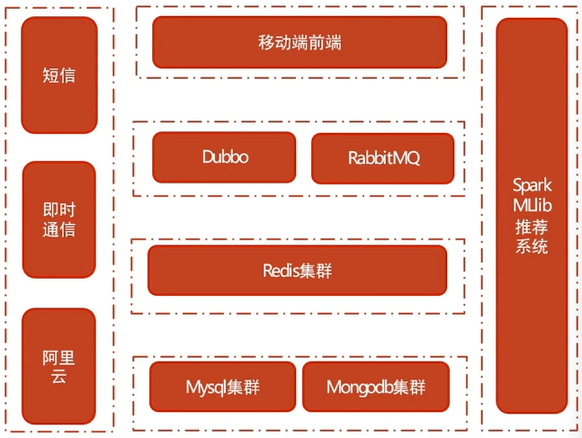
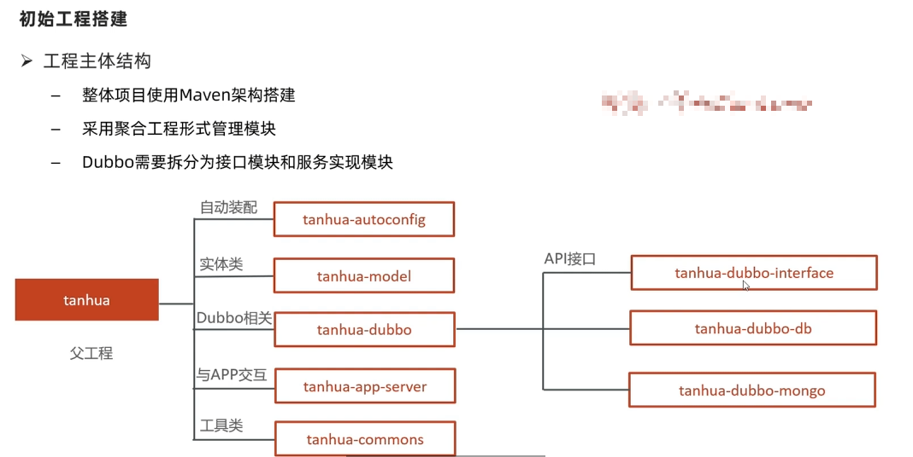
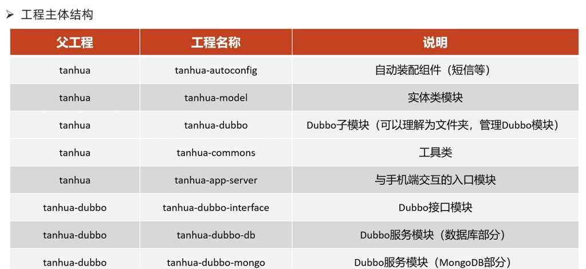
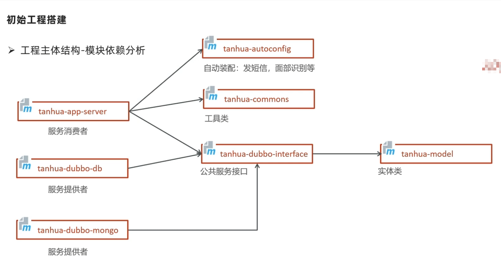

> D:\Java学习\2022_HM\05、阶段五 服务端框架基础+探花交友项目\04、第四章 探花交友项目

# 探花交友项目介绍

## 项目简介

探花交友是一个陌生人的在线交友平台，在该平台中可以搜索附近的人，查看好友动态，平台还会通过大数据计算进行智能推荐，通过智能推荐可以找到更加匹配的好友，这样才能增进用户对产品的喜爱度。探花平台还提供了在线即时通讯功能，可以实时的与好友进行沟通，让沟通随时随地的进行。

## 技术方案

前端：

- flutter + android + 环信SDK + redux + shared_preferences + connectivity + iconfont + webview + sqflite

后端：

- Spring Boot + SpringMVC + Mybatis + MybatisPlus + Dubbo
- MongoDB geo 实现地理位置查询
- MongoDB 实现海量数据的存储
- Redis 数据的缓存
- Spark + MLlib 实现智能推荐
- 第三方服务 环信即时通讯
- 第三方服务 阿里云 OSS 、 短信服务

## 技术架构

前端：

- flutter + android + 环信SDK + redux + shared_preferences + connectivity + iconfont + webview + sqflite

后端：

* 采用Dubbo作为微服务架构技术
* 采用RabbitMQ 作为消息服务中间件
* 采用Redis实现缓存的高可用
* 采用Mysql,MongoDB进行海量数据的存储
* 集成第三方应用组件（阿里云，短信，即时通信）
* 基于Spark Mllib推荐系统

## 技术解决方案

- 使用MongoDBgeo实现附近的人的解决方案
- 使用Spark + Mllib实现智能推荐的解决方案
- 使用MongoDB进行海量数据的存储的解决方案
- 使用采用分布式文件系统存储小视频数据的解决方案
- 使用百度人脸识别的解决方案
- 使用阿里云进行短信验证码发送的解决方案

## 技术亮点

- 采用MongoDB geo实现地理位置查询
- 采用RabbitMQ作为消息服务中间件
- 采用MongoDB进行海量数据的存储
- 采用Spark + Mllib实现智能推荐
- 采用环信服务实现即时通讯
- 采用分布式文件系统存储小视频数据
- 采用SpringCloud Alibaba Dubbo作为微服务架构技术
- 采用SpringBoot + Mybatis实现系统主架构
- 采用Redis集群实现缓存的高可用

## 附图

# 

## 登录
